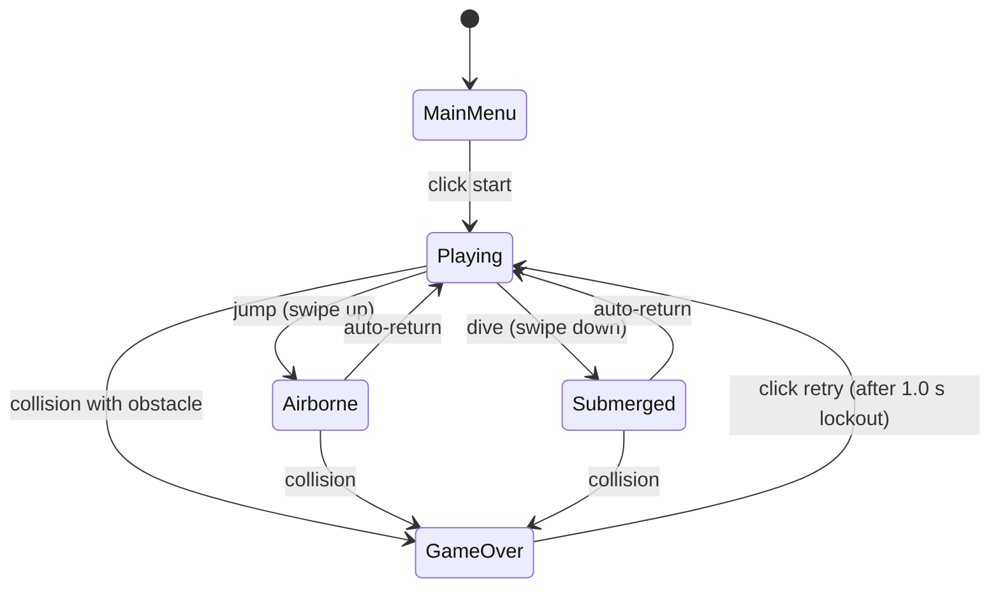
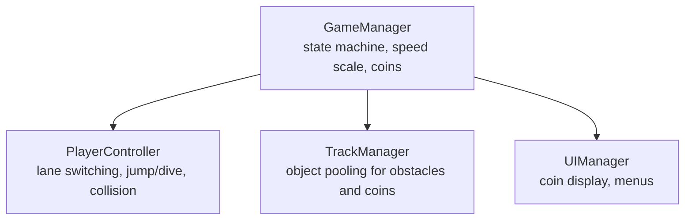

# Game Design Document — River Surfer

| | |
|---|---|
| **Working title** | River Surfer |
| **Team** | Ben Lutenberg , Peleg wurzel |
| **Genre** | 3-Lane Endless Runner / Arcade score-chaser |
| **Target platform** | PC (Windows) + Mobile (Android), standalone builds |
| **Engine / Unity version** | Unity 6 (6000.3.12f1), URP, 3D |
| **Orientation & reference resolution** | Landscape, 1920 × 1080 reference |
| **Expected session length** | 1 – 3 minutes per run |
| **Document version** | v1.1 — 2026-09-22 |

---

## 1. High Concept

The player controls a speedboat moving forward on a 3-lane river. The water uses a scrolling shader, while obstacles and coins translate towards the camera. The player instantly snaps between left, center, and right lanes, jumps over low hazards, and dives under high archways to dodge. Collecting coins increases global speed. Touch an obstacle, die instantly. Restart takes under one second.

### Design pillars

1. **Deterministic dodging** — Lane switching, jumping, and diving snap precisely to fixed coordinates and durations. No physics-based sliding. Every collision is strictly the player's fault and must feel like it.
2. **Readability above all** — Obstacles (low logs, high bridges, full rocks) must contrast sharply with the stylized water shader so the player can instantly recognize which dodge action is required.
3. **Pure arcade loop** — Fast restarts, zero downtime. This is why there is no complex meta-progression, inventory management, or story.

---

## 2. Reference & Inspiration

- **Primary reference:** Subway Surfers. Taking: 3-lane switching, jump/duck mechanics, forward-scrolling illusion. Not taking: meta-progression, coin-based shop, power-ups, police chase mechanics.
- **Visual reference:** Kenney.nl Watercraft Pack / Low-poly stylized aesthetics.
- **Video:** [Subway Surfers Gameplay Reference](https://www.youtube.com/watch?v=vTfD20dbxho)

---

## 3. Core Game Loop

**Moment-to-moment rules**

- The speedboat remains at a fixed Z-position. River obstacles (rocks, buoys) and coins translate negatively along the Z-axis.
- Left/Right input changes the boat's target X-position between three fixed coordinates (lanes).
- Up/Down input temporarily alters the boat's Y-position (jump/dive) for a fixed duration before returning to baseline (Y=0).
- Actions are interpolated smoothly. Inputs during interpolation are buffered.
- **Scoring:** The score increments by 1 for each coin collected. Every collected coin permanently increases the global scroll speed by `0.5 u/s`.
- **Failure:** Colliding with any solid obstacle (e.g., hitting a high bridge while not diving) triggers a crash state, locks input, and opens the Game Over screen after a 1-second delay.

### Parameters you will need to tune

| Parameter | What it controls | First guess |
|---|---|---|
| `baseScrollSpeed` | Starting velocity of the river obstacles moving towards the player | 10.0 u/s |
| `speedIncreasePerCoin`| How much the scroll speed increases per collected coin | 0.5 u/s |
| `laneSwitchTime` | How fast the boat lerps from one lane to another | 0.15 s |
| `verticalActionDuration`| Total time (in seconds) a jump or dive lasts before returning to zero | 0.6 s |
| `jumpHeight` | Max Y-axis offset during a jump | +2.0 u |
| `diveDepth` | Max Y-axis offset during a dive | -1.5 u |

**Where these live:** `[SerializeField]` fields on the `GameManager` and `PlayerController` scripts.

**Feel target:** A first-time player easily identifies which obstacles require jumping versus diving, and collects at least 10 coins before the speed overwhelms them.

---

## 4. Controls & Input

| Action | Keyboard / Mouse | Touch |
|---|---|---|
| **Move Left** | Left Arrow | Swipe Left |
| **Move Right** | Right Arrow | Swipe Right |
| **Jump** | Up Arrow | Swipe Up |
| **Dive / Duck** | Down Arrow | Swipe Down |
| **Menu / Pause** | Esc | Tap UI Button |

- Input is read on **press/swipe** in `Update` using the Unity Input System, buffered, and applied via mathematical interpolation (Lerp / DOTween) in `FixedUpdate` or equivalent update cycle, bypassing the physics engine for lateral and vertical movement.
- If the player presses/taps the action while a UI button is under the cursor (e.g., Pause), the UI consumes the input and no movement occurs.
- On the Game Over screen, there is a 1-second input lockout to prevent accidental immediate restarts.

---

## 5. Screens & UI

1. **Main Menu** — Title text ("River Surfer"), "Start Run" button, "Quit" button.
2. **Gameplay** — A simple, high-contrast coin counter at the top center.
3. **Game Over** — "Game Over" text, Final Coin Score, High Score, "Retry" and "Main Menu" buttons.

- **HUD during play:** Coin text only. Deliberately absent: health bars, mini-maps, speed meters, power-up timers.
- **Canvas setup:** Screen Space – Overlay, CanvasScaler *Scale With Screen Size*, reference 1920 × 1080, Match Width Or Height = 0.5.

---

## 6. Art & Audio

| Asset | Variants / frames | Source & licence | Use |
|---|---|---|---|
| **Speedboat** | 1 model | Kenney.nl (Watercraft Pack), CC0 | Main character |
| **Obstacles** | Rocks (Full block), Logs (Jump over), Bridges (Dive under) | Kenney.nl, CC0 | River hazards |
| **Water Shader** | Animated material | Custom (Shader Graph) | River surface |
| **BGM / SFX** | BGM, Splash, Crash, Coin, Jump/Dive whoosh | CC0 / Royalty Free | Audio feedback |

**Licence note:** 3D models sourced from Kenney.nl under CC0 license. Water shader is custom-built. There are no proprietary assets requiring attribution for the public MVP.

**Technical art rules:** URP setup. Obstacle types (Low, High, Full) must be distinctly silhouette-readable against the water shader at high speeds. Sorting/Rendering ensures UI > Water > Objects.

---

## 7. Technical Design

**Scenes:** One scene, `Main.unity`; restarting resets logic and object pools rather than reloading the scene to prevent GC spikes.

**Packages / systems used:** Unity Input System, URP 3D, DOTween.

**Target device:** PC (Windows) and Android mobile.

**Architecture:**

| Script | Responsibility |
|---|---|
| `GameManager` | Tracks current coins, calculates global scroll speed, handles Game Over state. |
| `PlayerController` | Listens to directional input, handles DOTween X/Y position changes, detects triggers. |
| `TrackManager` | Spawns obstacles and coins from a pool, moves them on Z, recycles them. |

### The course features you are implementing

1. **Object Pooling** — Implemented in `TrackManager`. Both obstacles and coins are recycled continuously because instantiating during play causes GC spikes that cost frames, and a dropped frame in a high-speed timing game is an unfair death.
2. **State Machine** — Used in `GameManager` to strictly separate `MainMenu`, `Playing`, and `GameOver` logic, ensuring input and scrolling only happen during the `Playing` state.

---

## 8. Scope

### 8.1 MVP — the game is not a game without these

- [ ] 3-lane lateral movement snapping logic.
- [ ] Vertical dodge logic (Jump state and Dive state via Y-axis interpolation).
- [ ] Z-axis scrolling of obstacles and coins using an Object Pool.
- [ ] Distinct obstacle types (Full-block, Low-block to jump over, High-block to dive under).
- [ ] Scrolling water shader for the river surface.
- [ ] Coin collection system that increments global speed.
- [ ] Game over state and score tracking based on collected coins.

### 8.2 Polish — if the MVP is done and playable

- [ ] DOTween integration for visually smooth movement arcs and boat tilting (roll/pitch).
- [ ] Audio manager with BGM and SFX.
- [ ] Persistent high-score saving using `PlayerPrefs`.
- [ ] Particle effects (water splashes upon landing a jump or crashing).

### 8.3 Explicitly out of scope — we are **not** building these

- Collectibles beyond the primary speed-increasing coins.
- Power-ups (magnets, jetpacks, invincibility).
- Complex river variations (curved rivers, ramps, verticality).
- In-game shop or meta-progression.

---

## Changelog

| Version | Date | Change |
|---|---|---|
| v1.0 | 2026-09-22 | Initial draft adapted to River Surfer concept |
| v1.1 | 2026-09-22 | Added Jump and Dive mechanics (Y-axis dodge), corresponding obstacle types, and formatting cleanups |
