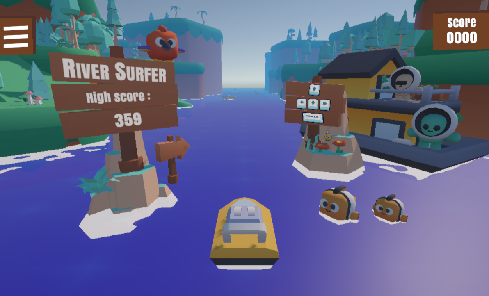

# River Surfer 🚤

🎮 **[Play the Game in your Browser!](https://benl000.itch.io/riversurfer)**

A 3-lane endless runner built with Unity 6 as a final course project at The Academic College of Tel Aviv-Yaffo. 
Navigate a speedboat, jump over logs, dive under bridges, and collect coins to survive the accelerating river!

## 🕹️ Controls

* **Left / Right Arrows:** Change lanes
* **Up Arrow:** Jump over obstacles
* **Down Arrow:** Dive under obstacles
* **Space / Esc:** Start / Pause game

## 👥 Team

* **Ben Lutenberg**
* **Peleg Wurzel**

## 📄 Documentation

* **[Read the full Game Design Document (GDD) here](Docs/GDD.md)**
